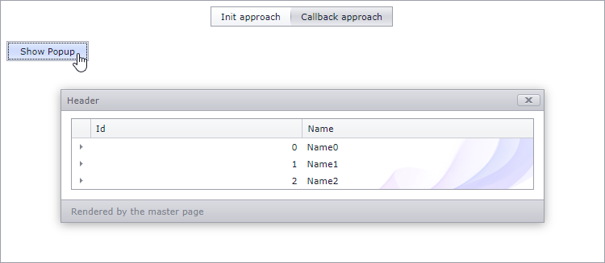

<!-- default badges list -->
[](https://supportcenter.devexpress.com/ticket/details/T501713)
[](https://docs.devexpress.com/GeneralInformation/403183)
<!-- default badges end -->
# Popup Control for ASP.NET Web Forms - How to use one pop-up across all pages

You can use one [Popup Control](https://docs.devexpress.com/AspNet/3582/components/docking-and-popups/popup-control) across all pages of your application to improve its performance. This example demonstrates how to create a popup control on the master page, invoke the control from multiple pages, and populate it with page-specific content.



The **WebForm1** page populates the popup control with content during its initialization. The **WebForm2** page specifies the pop-up windows's content once the control sends a callback to the server. Use **Init approach** and **Callback approach** menu items to switch between these pages. Click the **Show Popup** button to invoke the pop-up window.

## Overview

Place an empty popup control in the root master page to make this control accessible from any page:

```aspx
<%@ Master Language="C#" AutoEventWireup="true" CodeBehind="root.master.cs" Inherits="T501708_1.root" %>

<!DOCTYPE html>

<html>
    <head runat="server">
        <title></title>
        <asp:ContentPlaceHolder ID="head" runat="server">
        </asp:ContentPlaceHolder>
    </head>
    <body>
        <form id="form1" runat="server">
            <dx:ASPxPopupControl ID="popupControl" runat="server" ClientInstanceName="popup" >
            </dx:ASPxPopupControl>
            <div>
                <asp:ContentPlaceHolder ID="ContentPlaceHolder1" runat="server">
                </asp:ContentPlaceHolder>
            </div>
        </form>
    </body>
</html>
```

Use the popup control's client instance name to access this instance from a page. The code sample below uses the client-side instance to invoke the pop-up window:

```js
function button1_Click(s, e) {
    popup.Show();
}
```

Handle the popup control's `Init` or [WindowCallback](https://docs.devexpress.com/AspNet/DevExpress.Web.ASPxPopupControlBase.WindowCallback) event and populate the control with page-specific content. You can define popup content for each page in the master page or put all the content logic to the corresponding page code. To do the later, follow the steps below:

1. Create an event delegate in the master page:

    ```cs
    public event EventHandler PopupInit;  
    protected void popupControl_Init(object sender, EventArgs e) {
        if (PopupInit != null)
            PopupInit(sender, e);
    }
   ```
2. Specify the master page's type name in the content page:
    ```aspx
    <%@ MasterType TypeName="T501713.Root" %>  
    ```

3. Call the event delegate in the content page:

    ```cs
    protected void Page_PreInit(object sender, EventArgs e) {  
        Master.PopupInit += Master_PopupInit;  
    }

    private void Master_PopupInit(object sender, EventArgs e) {  
        //render a control  
    }  
    ```

## Files to Review

* [Root.Master](./CS/T501713/Root.Master) (VB: [Root.Master](./VB/T501713/Root.Master))
* [Root.Master.cs](./CS/T501713/Root.Master.cs) (VB: [Root.Master.vb](./VB/T501713/Root.Master.vb))
* [WebForm1.aspx](./CS/T501713/WebForm1.aspx) (VB: [WebForm1.aspx](./VB/T501713/WebForm1.aspx))
* [WebForm1.aspx.cs](./CS/T501713/WebForm1.aspx.cs) (VB: [WebForm1.aspx.vb](./VB/T501713/WebForm1.aspx.vb))
* [WebForm2.aspx](./CS/T501713/WebForm2.aspx) (VB: [WebForm2.aspx](./VB/T501713/WebForm2.aspx))
* [WebForm2.aspx.cs](./CS/T501713/WebForm2.aspx.cs) (VB: [WebForm2.aspx.vb](./VB/T501713/WebForm2.aspx.vb))

## Documentation

- [Docking and Popups](https://docs.devexpress.com/AspNet/14830/components/docking-and-popups)

## More Examples

- [How to customize a pop-up window's content and layout](https://github.com/DevExpress-Examples/asp-net-web-forms-popup-customize-content-and-layout)
- [How to create ASP.NET Web Forms controls dynamically](https://github.com/DevExpress-Examples/asp-net-web-forms-create-controls-dynamically)
